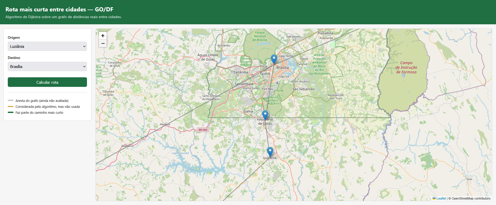
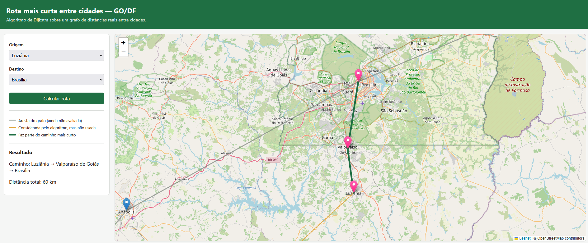
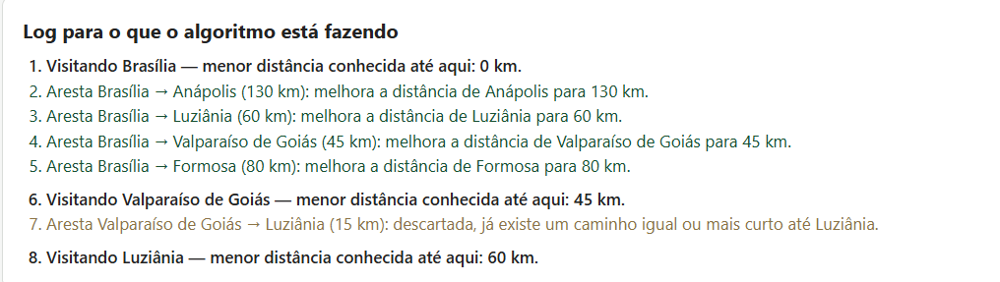

# Menor rota entre cidades

Número da Lista: Dupla 27<br>
Conteúdo da Disciplina: Algoritmo de Dijkstra<br>

Link vídeo apresentação: https://youtu.be/3C3arIsGwpM

## Alunos

|Matrícula | Aluno |
| -- | -- |
| 24/2015960  |  Thiago Henrique Machado de Souza |
| 24/2015915  |  Luiz Gustavo da Conceição Souza |

## Sobre

Este projeto é uma aplicação web que calcula e visualiza a rota mais curta entre cidades de Goiás e do Distrito Federal, usando o algoritmo de Dijkstra sobre um grafo de distâncias. O objetivo é expor o funcionamento interno do algoritmo de forma visual e didática — mostrando não apenas qual caminho venceu, mas também quais alternativas o algoritmo considerou e por que foram descartadas. 

## Screenshots

- Algoritmo antes de calcular menor rota entre dois nós
  

- Menor rota encontrada pelo algoritmo


- Passo a passo das etapas realizadas pelo Algoritmo

## Instalação

Linguagem: Python 3.10 + <br>
Framework: Flask<br>

Crie um ambiente virtual para instalar os pacotes rodando:
```
python -m venv venv
```
Após a criação, você deve ativar o ambiente para começar a usá-lo:

- Windows: `.\venv\Scripts\activate`

- Linux / macOS: `source venv/bin/activate`

<br> 

Baixe os requisitos do projeto rodando :
```
pip install -r requirements.txt
```

## Como Rodar

Com o ambiente virtual ativo, execute:
```
python run.py
```

Acesse a aplicação web em :
```
http://127.0.0.1:5000
```


